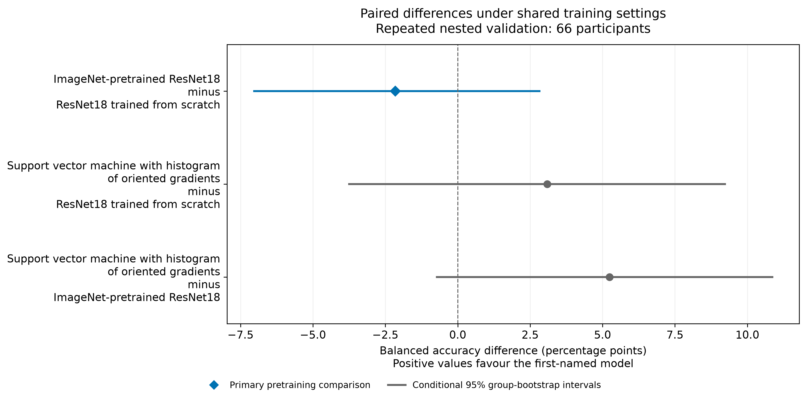
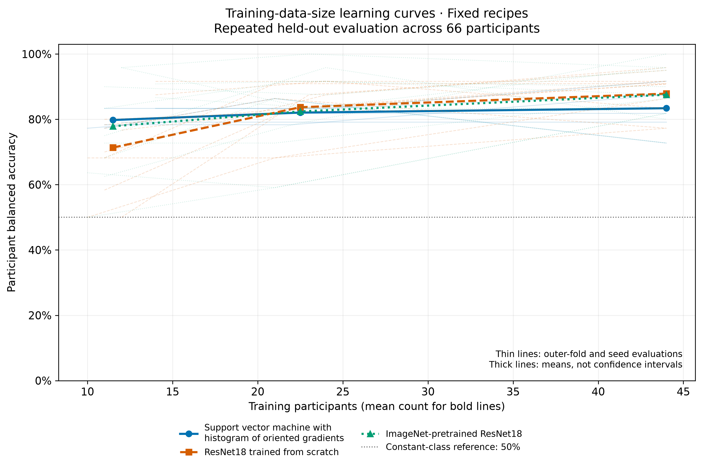
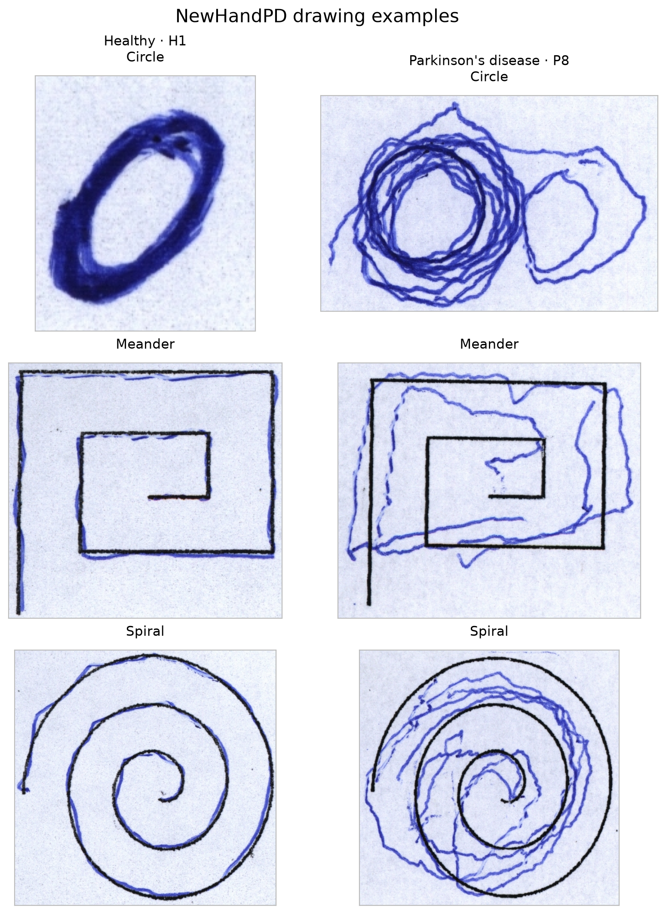

# Parkinson's Drawing Model Comparison

*A reproducible participant-level comparison of classical image features and ResNet18, examining the contribution of ImageNet pretraining to Parkinson's drawing classification.*

---

## Overview

This repository contains a Python notebook for comparing image-classification methods on the NewHandPD drawing dataset. The analysis evaluates three conditions using the same images and participant partitions:

- a support vector machine using [histogram of oriented gradients features (Dalal and Triggs, 2005)](https://doi.org/10.1109/CVPR.2005.177);
- [ResNet18 (He et al., 2015)](https://arxiv.org/abs/1512.03385) trained from random initialisation; and
- ResNet18 fine-tuned from ImageNet-pretrained weights.

The primary comparison holds the neural-network architecture and training settings constant to examine the contribution of pretraining. A secondary analysis selects settings separately for each neural condition, while learning curves assess sensitivity to training-set size under fixed training recipes.

[main.ipynb](main.ipynb) contains the complete workflow: data acquisition, image auditing, preprocessing, model selection, training, evaluation, explanation and result verification. Its recorded results and embedded figures can be inspected without rerunning the analysis.

The classical pipeline achieves the highest observed mean balanced accuracy. The neural-network comparison does not establish a consistent pretraining advantage: its direction changes with the training-selection procedure and training-set size. The study is an exploratory analysis of an existing dataset, not a clinical diagnostic system.

## Research Questions

1. Does ImageNet pretraining improve participant-level balanced accuracy under a shared ResNet18 training recipe?
2. How do both neural-network conditions compare with a classical image-classification pipeline?
3. Does the pretraining comparison change when settings are selected separately for each neural condition?
4. How does performance change as the number of training participants increases under fixed settings?

---

## Findings

### Repeated Participant-Level Evaluation

Two repetitions of three outer folds evaluate all 66 participants. Three inner folds select settings within each outer training partition, and two paired final training seeds are used for each neural condition. Participants linked by identical images remain together throughout splitting.

| Model | Mean balanced accuracy | Conditional 95% interval |
| :--- | ---: | ---: |
| Support vector machine with histogram of oriented gradients | 90.4% | 82.9–96.4% |
| ResNet18 trained from scratch | 87.4% | 80.8–93.2% |
| ImageNet-pretrained ResNet18 | 85.2% | 78.6–91.2% |

Balanced accuracy is the mean of sensitivity for Parkinson's disease and specificity for healthy participants. Repeated correctness is averaged within each participant before calculating these estimates; the results describe mean run performance, not an ensemble.



The primary pretrained-minus-from-scratch difference is **−2.2 percentage points**, with a conditional 95% interval of **−7.1 to +2.9 percentage points**. The interval includes zero and does not establish benefit, harm or equivalence.

The blue diamond identifies this primary comparison. Positive values favour the first-named model. Intervals use 5,000 paired, class-stratified resamples of duplicate-linked participant groups and are conditional on the observed predictions; they exclude uncertainty from refitting the models.

### Training-Setting Sensitivity

Selecting settings separately from the same candidate grid and inner-fold measurements produces balanced accuracies of 85.7% for training from scratch and 86.9% for pretraining. The resulting pretrained-minus-from-scratch difference is **+1.2 percentage points**.

This analysis asks about separately selected training procedures, rather than performance under matched settings. The change in direction prevents interpreting the primary result as evidence that pretraining is intrinsically harmful.

### Training-Data-Size Learning Curves



| Available training groups used | Actual training participants | Mean pretrained-minus-from-scratch difference |
| :--- | ---: | ---: |
| 25% | 10–14 | +6.5 percentage points |
| 50% | 21–24 | −1.3 percentage points |
| 100% | 44 | −0.3 percentage points |

These differences average paired outer-fold and training-seed comparisons. Training recipes remain fixed across sizes; they are not independently tuned at each size. Thin lines show individual evaluations and thick lines show means. Their spread is not a confidence interval.

The observed benefit at the smallest training size does not establish a general small-sample advantage.

### Original Fixed Test Split

The original comparison uses 52 training participants and 14 held-out participants, with seven people from each class in the test partition. It is supporting analysis from the same cohort, not independent confirmation of the repeated study.

| Model | Balanced accuracy | Sensitivity | Specificity | Area under the receiver operating characteristic curve |
| :--- | ---: | ---: | ---: | ---: |
| Support vector machine with histogram of oriented gradients | 92.9% | 100.0% | 85.7% | 0.878 |
| ResNet18 trained from scratch | 78.6% | 100.0% | 57.1% | 0.980 |
| ImageNet-pretrained ResNet18 | 71.4% | 57.1% | 85.7% | 0.939 |

Sensitivity of 100% here means seven correct classifications, not perfect population sensitivity. The area under the curve measures ranking across thresholds; balanced accuracy measures classification at the fixed zero threshold. These measures need not rank the models in the same order.

The [confusion matrices](figures/participant_confusion_matrices.png), [receiver operating characteristic curves](figures/test_roc_participant.png) and [task-specific balanced accuracies](figures/task_balanced_accuracy.png) provide the supporting breakdown.

---

## Methodology

### Dataset and Drawing Tasks

The notebook downloads the image archives directly from the [NewHandPD dataset page at São Paulo State University](https://wwwp.fc.unesp.br/~papa/pub/datasets/Handpd/). The dataset is described by [Pereira et al. (2016)](https://doi.org/10.1109/SIBGRAPI.2016.054) and contains drawing images alongside smart-pen movement recordings. This analysis uses only the static images.

| Dataset component | Included in this analysis |
| :--- | :--- |
| Participants | 66: 35 healthy and 31 with Parkinson's disease |
| Drawing images | 594: 315 healthy and 279 Parkinson's |
| Drawings per participant | Nine: one circle, four meanders and four spirals |
| Duplicate-linked splitting groups | 60 |

<p align="center">
  
</p>

The examples show the original circle and first meander and spiral repetitions for H1 and P8. Orientation correction and display scaling are applied for the figure; source files remain unchanged.

### Data Cleaning

P8 has meander files numbered 1, 2, 3 and 5, with no `mea4` file. No other participant in the analysed dataset has a `mea5` file. During data cleaning, `mea5-P8.jpg` is therefore assigned the analytical task label `mea4`, treating the filename as an inferred numbering error.

The original image, filename and filename-derived task label are preserved. The annotation records the source checksum, evidence and inferred status, and execution stops if the source does not match. This convention does not establish acquisition order and has not been confirmed by the dataset authors.

### Image Audit and Participant Separation

File checksums and decoded pixel comparisons identify exact duplicates. Participants connected by identical images receive one splitting-group identifier, preventing known duplicates from crossing training and evaluation partitions.

Non-identical near-matches are screened within drawing tasks and displayed in a paginated gallery. All 25 candidate image pairs were manually reviewed and confirmed distinct. The notebook's image audit retains image fingerprints, decisions and review history.

New unresolved candidates block training until reviewed. Confirmed duplicates link participants before splitting; conflicting class labels stop execution for investigation. Screening is not exhaustive, and image-content review does not establish participant identity.

### Preprocessing and Model Conditions

Every image is orientation-corrected, converted to greyscale, resized without changing its aspect ratio and centred on a white 128 × 128-pixel square. Pixel intensities are scaled to the range zero to one. Processing takes place in memory without replacing source files.

| Condition | Model family | Representation and training |
| :--- | :--- | :--- |
| Histogram of oriented gradients with a support vector machine | Classical machine learning | 8,100 edge-direction features; scaling fitted within each training partition; linear or radial basis function kernel |
| ResNet18 trained from scratch | Deep learning | Randomly initialised 18-layer residual network; all layers trained on NewHandPD |
| ImageNet-pretrained ResNet18 | Deep learning | The same architecture starting from [TorchVision's IMAGENET1K_V1 weights](https://docs.pytorch.org/vision/stable/models/generated/torchvision.models.resnet18.html); all layers fine-tuned on NewHandPD |

For both ResNet18 conditions, the greyscale image is copied into three channels and normalised using ImageNet channel statistics. This adds no colour information. The 128-pixel input deliberately differs from TorchVision's standard 224-pixel centre-crop recipe.

The neural conditions share participant folds, minibatch order, paired random seeds, class weighting and identically initialised replacement output layers. The pretrained backbone weights and batch-normalisation state are the intended difference.

### Model Selection

The classical search compares linear and radial basis function kernels with training-error penalties of 0.1, 1 and 10. The neural search compares learning rates of 0.0003 and 0.001 at 10, 20 and 30 epochs, using batches of 32, the Adam optimiser and weight decay of 0.0001.

The primary comparison selects a shared neural recipe by maximising mean participant-level balanced accuracy across both conditions and the inner folds. The secondary analysis selects settings separately using the same inner-fold measurements. Outer evaluation participants do not participate in setting selection. The original fixed split uses five training-validation folds.

Learning curves use class-stratified, nested subsets of 25%, 50% and 100% of the available outer-training groups. Their fixed recipes are a radial basis function support vector machine with training-error penalty 1, and both ResNet18 conditions trained for 10 epochs at learning rate 0.0003.

### Participant Predictions and Explanations

Each participant's prediction averages the nine raw drawing scores, then applies a fixed zero threshold. Scores at or above zero predict the Parkinson's class. Support vector machine decision scores and neural-network logits are not calibrated probabilities.

Occlusion sensitivity masks image regions and measures the change in drawing score. Additional mask-size comparisons examine the stability of these explanations. The [healthy error example](figures/occlusion_healthy_error.png) and [correct Parkinson's drawing example](figures/occlusion_parkinsons_correct.png) illustrate sensitivity to masking, not clinical signs or causal explanations.

The notebook also reports training time, prediction throughput and serialised model size for the original fixed-split comparison.

---

## Repository Structure

```text
ParkinsonsDrawingModelComparison/
├── main.ipynb                 # Complete analysis, checks and recorded results
├── README.md
├── requirements.txt           # Pinned direct dependencies
├── .gitignore                 # Exclude local data, caches and result archives
├── LICENSE
└── figures/                   # Eight PNG figures and five statistical SVG versions
```

The notebook creates local working folders for downloaded data, fitted-model caches, annotations and result archives. These folders are ignored by Git. The dependency specification, review annotations and source-checksum records needed for execution are embedded in the notebook and restored when missing; existing local copies are preserved. No separate analysis scripts or result archive are required to open the notebook and read its recorded findings.

## Reproducing the Analysis

### 1. Create the Environment

The recorded environment uses Python 3.12.10 on Windows 11. From PowerShell:

```powershell
git clone https://github.com/John-JonSteyn/ParkinsonsDrawingModelComparison.git
cd ParkinsonsDrawingModelComparison
py -3.12 -m venv .venv
.\.venv\Scripts\Activate.ps1
python -m pip install -r requirements.txt
```

If activation is blocked, use `.\.venv\Scripts\python.exe` instead of `python`. Activation is not required when using the environment's interpreter directly.

The notebook records the installed package versions during execution. `requirements.txt` is the only dependency file maintained in the repository.

### 2. Open the Notebook

```powershell
python -m ipykernel install --user --name parkinsons-drawing-model-comparison --display-name "Python (.venv) - ParkinsonsDrawingModelComparison"
python -m jupyterlab main.ipynb
```

Select **Python (.venv) - ParkinsonsDrawingModelComparison** in JupyterLab or Visual Studio Code. Keep the filename as `main.ipynb` and the working directory at the repository root.

The **Recorded results** section can be read without executing cells. Its tables and embedded figures represent the saved execution; rerunning the notebook does not replace them automatically.

### 3. Run the Analysis

The default settings are:

```python
USE_SAVED_RESULTS = True
RESEARCH_VALIDATION_MODE = "full"
REQUIRE_SAVED_TRAINING_RESULTS = False
EXPORT_DIAGNOSTIC_FIGURES = False
```

Restart the kernel and run the cells in order. The workflow verifies or downloads six university image archives, checks the image inventory, applies the review annotations and constructs participant-group partitions before fitting models. ImageNet weights are downloaded when first required. No Kaggle account or token is needed.

Execution uses the computer's processor; a graphics processor is not required. The recorded full run took approximately six hours. Subsequent executions reuse existing downloads and compatible model caches. A fresh clone must obtain the images and train the models locally; fitted-model caches are not distributed.

If the audit identifies unresolved candidates, inspect them under **Review near-duplicate candidates**:

```python
show_near_duplicate_candidates(page_number=1, pairs_per_page=5)
```

Increase the page number to inspect further pairs. Record a decision with `record_near_duplicate_review(candidate_number, decision, reviewer, rationale)`, using `"distinct"`, `"duplicate"` or `"unresolved"` and a pair-specific explanation.

After changing review decisions, save the notebook, restart the kernel and run the analysis again. Changes to annotations invalidate earlier experiment signatures. Update the embedded annotation copies before sharing a revised notebook.

### 4. Reuse Saved Models

For local inference with compatible fitted-model caches:

```python
USE_SAVED_RESULTS = True
RESEARCH_VALIDATION_MODE = "skip"
REQUIRE_SAVED_TRAINING_RESULTS = True
```

These settings require prepared data, pretrained weights and verified local model caches. Missing or incompatible fits raise an error rather than starting training. The **Demonstrate a complete participant prediction** section applies the three fitted models to one complete set of nine drawings. Its existing held-out example is not a new validation case.

Set `USE_SAVED_RESULTS = False` to request retraining. `RESEARCH_VALIDATION_MODE = "smoke_test"` performs a reduced nested execution check; those scores are not research results. Neither `"skip"` nor `"smoke_test"` alone prevents training in the original fixed-split sections. Restore the full-analysis settings when generating a complete research export.

## Reproducibility

Data checksums, annotations, participant partitions, preprocessing, modelling functions and package versions contribute to experiment signatures. Feature scaling and model selection are fitted within the relevant training partitions. Participants, duplicate-linked groups and identical image content are checked for overlap before evaluation.

Downloads use temporary files, bounded retries and checksum verification. Missing images can be restored from verified local archives; altered sources stop execution. The source-asset manifest embedded in the notebook records archive URLs, image checksums and the pretrained-weight checksum. These identify the recorded input bytes, not publisher-signed authenticity.

Completed fits are cached separately and reused only when their signatures and file checksums match. Interrupted fits restart from their declared seeds. Only trusted, locally generated model caches should be loaded.

The notebook's **Verify the analysis** and **Export verified results** sections check partitions, model-selection records, drawing scores, participant averages and recalculated metrics. Full exports are verified before the local latest-results pointer is updated. Deterministic settings do not guarantee identical numerical results across different hardware or software environments.

Code-cell outputs and execution counts are cleared in the repository notebook. Recorded tables and figures are retained in Markdown cells and image attachments; clearing code outputs does not remove them.

## Saved Results

The notebook's **Recorded results** section contains the verified tables and eight embedded PNG figures from execution `20261005T084722345798Z`, completed on 5 October 2026. Its numerical summary and figure checksums are embedded in the notebook metadata. These findings can be read without downloading the dataset or training the models.

The `figures/` folder contains the selected images used in this README, with SVG versions of the five statistical figures. These are the only separately saved research outputs tracked by Git.

Full executions also generate detailed predictions, settings, training histories, input provenance and verification reports under local `results/runs/` directories. The entire `results/` folder, `figures/runs/`, raw data and fitted-model caches are ignored by Git. These local records support metric verification and later figure reconstruction without adding execution archives to the public repository.

New runs do not automatically overwrite the selected figures or the notebook's dated result appendix. Both should be updated only from a verified full execution. Earlier local result archives remain available but are not required to read the recorded findings.

## Study Scope

- **Sample size:** 594 drawings represent 66 people. Repeated folds and seeds do not create additional independent participants.
- **Internal validation:** both evaluation designs use the same previously inspected cohort. Neither is external or prospective validation.
- **Uncertainty:** group-bootstrap intervals are conditional on observed predictions and exclude refitting uncertainty. Overlapping folds are not treated as independent observations in a significance test.
- **Comparison scope:** conclusions apply to the declared preprocessing, candidate grid, training seeds and initialisation conditions, not the best attainable performance of either training procedure.
- **Unmeasured confounding:** the image manifest lacks linked age, sex, handedness, disease-severity and medication data. Demographic adjustment and clinical subgroup assessment are unavailable. Templates and acquisition characteristics may influence predictions.
- **Clinical interpretation:** the models predict dataset classes. Clinical use would require independent validation, acquisition and quality controls, subgroup assessment and a defined decision process.

## Licence

The repository code is available under the [MIT Licence](LICENSE). The NewHandPD dataset and pretrained weights are third-party resources; this licence does not relicense them. Consult their original sources and follow the dataset authors' citation requirements when reusing the data or example images.
